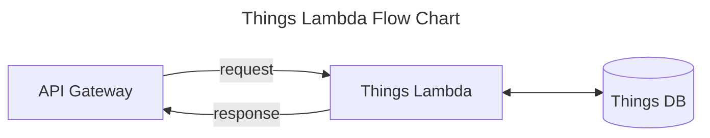
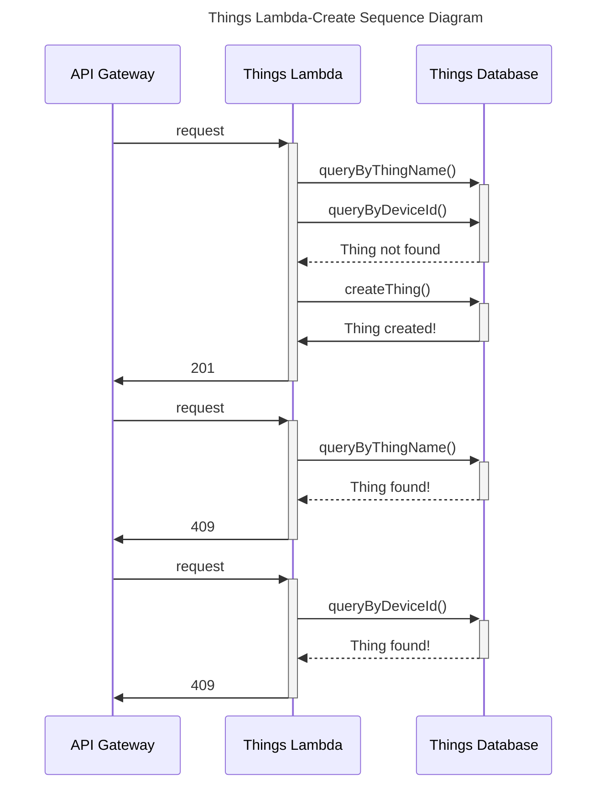

```mermaid
---
title: Things Lambda Flow Chart
---
flowchart LR

    API_Gateway[API Gateway] --request---> ThingsLambda[Things Lambda] <---> ThingsDB[(Things DB)]
    ThingsLambda --response--> API_Gateway
```

```mermaid
---
title: Things Lambda-Create Sequence Diagram
---

sequenceDiagram

    API Gateway ->>+ Things Lambda: request
    Things Lambda ->>+ Things Database: queryByThingName()
    Things Lambda ->> Things Database: queryByDeviceId()
    Things Database -->>- Things Lambda: Thing not found
    Things Lambda ->>+ Things Database: createThing()
    Things Database ->>- Things Lambda: Thing created!
    Things Lambda ->>- API Gateway: 201
    
    API Gateway ->>+ Things Lambda: request
    Things Lambda ->>+ Things Database: queryByThingName()
    Things Database -->>- Things Lambda: Thing found!
    Things Lambda ->>- API Gateway: 409
    
    API Gateway ->>+ Things Lambda: request
    Things Lambda ->>+ Things Database: queryByDeviceId()
    Things Database -->>- Things Lambda: Thing found!
    Things Lambda ->>- API Gateway: 409
```
